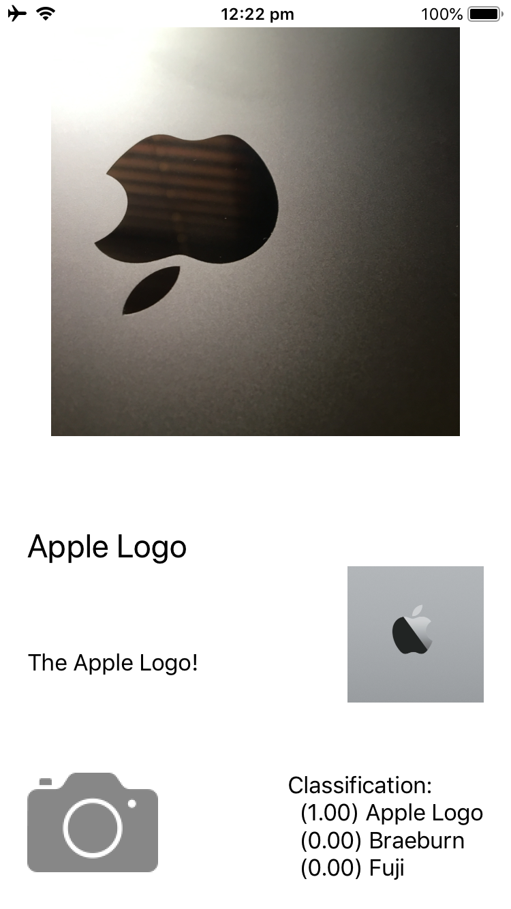

# WhatsApple iOS

  

This is the iOS app version of [WhatsApple](https://github.com/gg2001/WhatsApple), a Swift Playground that uses machine learning to classify pictures of apples.

## How to use

1. `git clone https://github.com/gg2001/WhatsApple-iOS.git`
2. `cd WhatsApple-iOS`
3. Open WhatsApple-iOS.xcworkspace

If there are any issues with loading assets:

1. Delete all red files in under the WhatsApple-iOS folder (the same folder that has ViewController.swift) in the Xcode project navigator.
1. Drag and drop everything from the assets folder back into the same WhatsApple-iOS folder in the Xcode project navigator.

